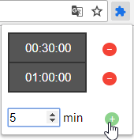
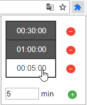
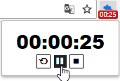
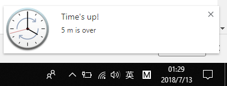

# EasyTimer
A simple, user-friendly chrome extension that provides basic functionality of a timer (start, pause, stop, restart). It supports time between 0 seconds and 100 hours (exclusive). 

Note: image file is currently not working properly so in the demo it shows a puzzle piece.

---------------------------------------------------------------------------------------------------------------------------------------
1. Add a custom time to the time list \

2. Select a time from the time list \

3. Timer starts with a color-coded badge \

4. You get notified when time is up! \

